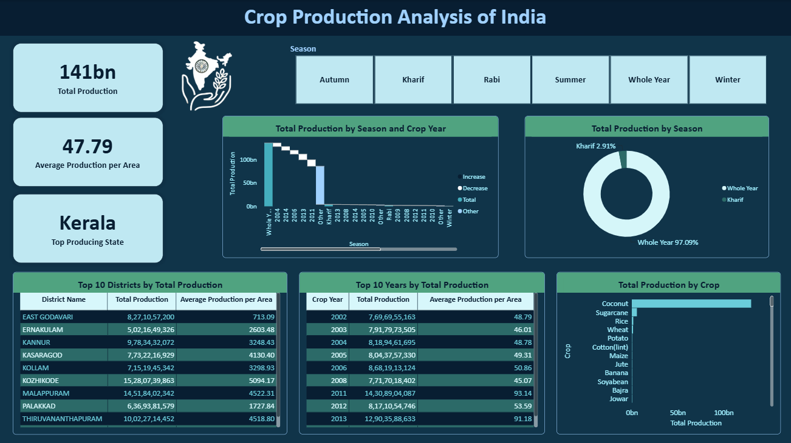
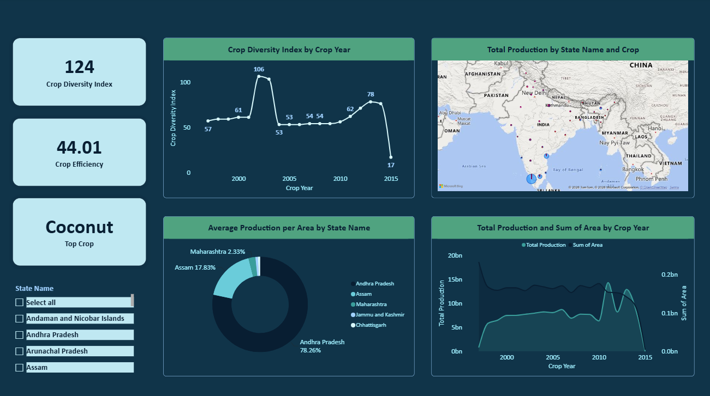

# 🌾 Crop Production Analysis of India

## Overview

This project is a 2-page interactive reporting dashboard in Power BI that analyzes 2.4 lakh+ crop records across 33 states, 646 districts, and 124 crops from 1997 to 2015. The analysis explores production trends, seasonal contribution, geographic distribution, crop diversity, and production efficiency to derive meaningful insights from Indian agricultural data.

## Dashboard Preview

### Overview and Insights

### Detailed Analysis

## Features & Visualizations

### 1. Overview and Insights

- Cards - Display KPIs such as Total Production, Average Production per Area, and Top Producing State.
- Waterfall chart - Analyzes total production by season and crop year.
- Donut chart - Explores seasonal contribution to total production.
- Tables - Display top 10 districts and top 10 years each by total production.
- Stacked bar chart - Compares each crop's contribution to total production.
- Slicer - Filters the data by season.

### 2. Detailed Analysis

- Cards - Display KPIs such as Crop Diversity Index, Crop Efficiency, and Top Crop.
- Line chart - Explores crop diversity index by crop year.
- Donut chart - Compares average production per area by state.
- Area chart - Analyzes total production and sum of area by crop year.
- Map - Displays total production by state and crop.
- Slicer - Filters the data by state.

## Key Insights

- Kerala was the top-producing state, with coconut contributing substantially to its production.
- Whole Year crops accounted for the majority of total production.
- 2011 recorded the highest total production among the years analyzed.
- Production patterns varied considerably across states, districts, seasons, and crops.

## Dataset

The dataset contains crop production records with the following fields:
- State
- District
- Crop Year
- Season
- Crop
- Area
- Production

## Tools & Technologies

- Microsoft Power BI
- Power Query - ETL
- DAX - Measures and KPI calculations
- Microsoft Excel - Source dataset

## Skills Demonstrated

- Data Cleaning
- Data Transformation
- Data Visualization
- Dashboard Design
- Business Intelligence
- KPI Reporting
- DAX Measures
- Power Query
